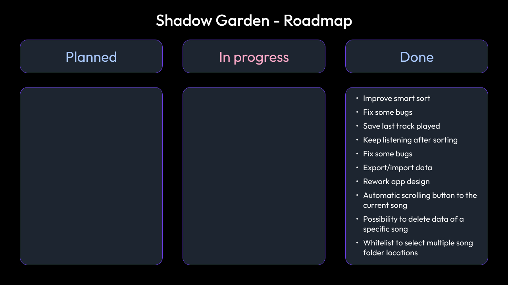

# Shadow Garden

> February 2024 to now

**Elevating Your Music Experience with Shadow Garden: The Smart Music Player App**

  

## I. Context

Introducing Shadow Garden, a music player app made with Flutter for smartphones. In a world inundated with music apps, Shadow Garden stands out with its innovative features designed to enhance your listening experience. Shadow Garden was born out of a desire to revolutionize the way users interact with their music collection.

## II. Objective

We imagined a music player that adapts to the user's listening habits, eliminating the need to constantly create playlists. Building on Flutter's versatility, we created an intuitive interface designed with simplicity and efficiency in mind, allowing users to seamlessly navigate their music library without having to worry about playlists or manual organization. The minimalist design puts the focus squarely on the music, with intuitive controls that make navigation a breeze. With Shadow Garden, what you see is what you listen, eliminating unnecessary functionality and focusing on what really matters: the music.

## III. Features

### Simplified music queue management

Shadow Garden streamlines the process of adding the next audio track with its intuitive queue management system. With a simple press, users can effortlessly queue up their favorite songs, ensuring uninterrupted playback without interrupting the flow.

### Customized loop

Say goodbye to endless scrolling through playlists. Shadow Garden offers custom looping capabilities, allowing users to specify the number of songs to loop over. Whether it's your favorite album or a curated selection of tracks, sort according to your preferences or customize the queue, loop on your selection and you're done.

### Smart Sort

Unleash the power of Shadow Garden's Smart Sort feature, which ranks songs based on your listening statistics. Say farewell to manual sorting and let Shadow Garden do the heavy lifting. With Smart Sort, your music library is dynamically organized according to your preferences, ensuring that your favorite tracks are always within reach.

  
  

## IV. Features details

### Simplified music queue management
- A 2-second long press on a song moves it to the next song.  

### Customized loop
- From any song, you can set the loop mode to custom loop mode and select, using the number selector, the number of a song in your loop. If you select 3 songs, the current song and the next 2 will be in the loop. At the end of the last song in the loop, the loop restarts from the first.
- You can combine this feature with `sort system` or `long press to add next song` to exploit all possibilities. Here is some example : 
  - You can listen to an album by sorting songs by album and selecting the number of songs from your album to loop.
  - You can start a song, add your favorite songs as next songs and loop them in on your personalized queue.

### Smart Sort
- Smart sort is a real-time ranking system for your songs based on your listening statistics. After each song, the data based on it is saved in a local database and the song's ranking is recalculated. :
  - To update the rank on the song page, simply set the smart loop again.
  - To update the rank of the statistics page, simply leave the page and return.
- If you want to skip a song without influencing its score, simply pause the player and then, skip the song.

**Shadow Garden: Redefining the Music Listening Experience, What You See is What You Listen!**

> #Flutter, #Music player, #Database, #Smart sort

## V. Roadmap

  

## V. Project Status

- [ ] Work in progress
- [X] Work completed
